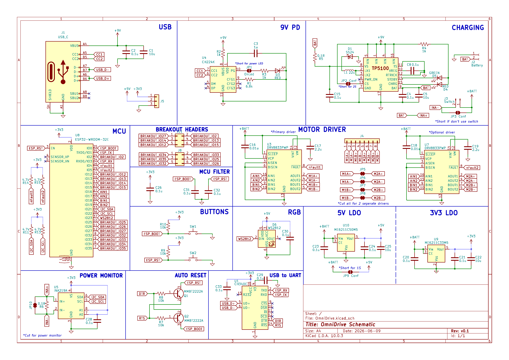
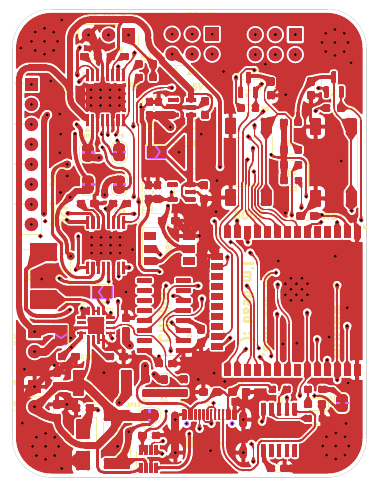
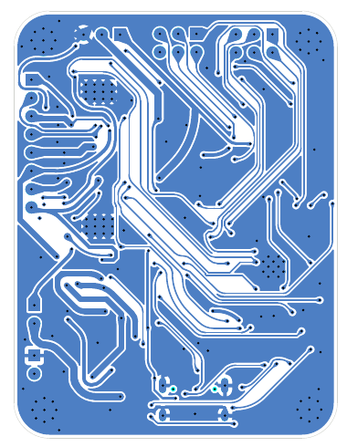

# OmniDrive

Dual H-bridge motor driver + ESP32 + USB-C PD, squeezed into a 45×59.5mm 2-layer board.

I wanted a board that could work with a single USB-C port and have it drive two motors (or 2 pairs if configured) while able to measure the board's current draw.

[](hardware/schematic.pdf)
*Full schematic — click image or [open PDF](hardware/schematic.pdf)*

[](hardware/PCB_Top.pdf)
*PCB front copper layer — [open PDF](hardware/PCB_Top.pdf)*

[](hardware/PCB_Bottom.pdf)
*PCB bottom copper layer — [open PDF](hardware/PCB_Bottom.pdf)*

## What it does

- Drives 2 or 4 DC motors (configurable) with two DRV8833 H-bridges, one DRV8833 is optimal, up to 1.5A per channel.
- Negotiates power over USB-C via CH224K to get 9V from power supply
- Measures total motor current with an INA219 over I2C
- Lets you program the ESP32 over USB through the CH340C, with automatic boot/reset
- Breaks out power lines and 14 GPIOs + I2C on a header for sensors, encoders, whatever
- Configurable 2S / 1S battery pack via solder pads

## Why I built it

I wanted something that could serve for multiple RC car or stepper driving projects without having to combine separate modules.

## Specs

| Part | What |
|------|------|
| MCU | ESP32-WROOM-32E |
| Motor drivers | 2× DRV8833 (HTSSOP-16, 1.5A/ch) |
| USB-C PD | CH224K sink, negotiates 5–20V |
| Current sense | INA219, 0.1Ω shunt, I2C |
| USB-UART | CH340C with auto DTR/RTS |
| Logic power | ME6211C50 (5V) → ME6211C33 (3.3V) |
| Breakout | 14 GPIO, I2C, WS2812 on 1×8 header |
| PCB | 2-layer, 1.6mm FR4, 45×59.5mm |

## Power flow

USB-C VBUS → CH224K negotiates voltage → +BATT rail

+BATT splits three ways:
- Directly to the DRV8833 motor drivers
- Through a 5V LDO (ME6211C50) for the CH340C and other devices
- It also then goes through a 3.3V LDO (ME6211C33) for the ESP32, INA219, WS2812,...

Motor current goes through a shared 0.1Ω sense resistor before reaching the drivers, so the INA219 sees total bus current. Per-motor would need two INA219s (maybe for later).

## Known issues / things to fix

A few things I'll change next version:

- The ME6211C33 is rated for 500mA and ESP32 can spike past that during WiFi TX. On a long USB-C cable with some voltage drop, the battery rail might sag enough to make the 3.3V regulator drop out. An AP2112 or similar low-dropout part would be safer.

- Didn't add TVS diodes on the USB-C CC/D+/D- lines or the motor outputs

- As mentioned, only total motor current. Can't tell which motor is drawing what.

## Files in hardware/

```
hardware/
├── schematic.pdf          — full schematic (click to view)
├── PCB_Front.pdf          — front copper render
├── PCB_Bottom.pdf         — bottom copper render
├── gerbers.zip            — Gerbers + drill files
├── bom.csv                — BOM for JLCPCB assembly
├── pick-place.csv         — centroid file
├── kicad/                 — source KiCad project
└── photos/                — PNG renders of schematic + PCB
```
